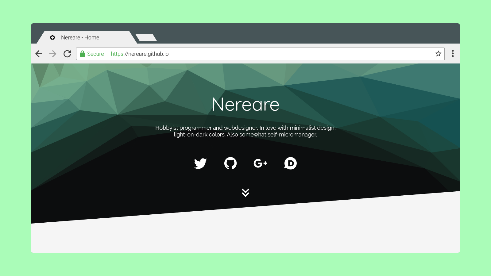

# Hepta Theme

A theme for Jekyll-based pages, created for [my personal page](https://nereare.github.io/).

## Installation

1. Clone this repository: `git clone https://github.com/Nereare/Hepta.git`
2. Install dependencies:
  * Install [Ruby](https://www.ruby-lang.org/en/downloads/) and...
  * ...[RubyGems](https://rubygems.org/pages/download) for your OS
  * Run `gem install jekyll bundler`
3. Run it: `bundle exec jekyll serve`
4. Go to [your local serving of jekyll](http://localhost:4000)

For guidance on how to use this theme, see the [Hepta Wiki](https://github.com/Nereare/Hepta/wiki).

## Contributing

1. Fork it!
2. Create your feature branch: `git checkout -b my-new-feature`
3. Commit your changes: `git commit -am 'Add some feature'`
4. Push to the branch: `git push origin my-new-feature`
5. Submit a pull request :smile:

## History

See the [Change Log](https://github.com/Nereare/Hepta/blob/master/changelog.md) for further history.

### Versioning

This projects uses [SemVer](http://semver.org/) for versioning. For the versions available, see the [tags on this repository](https://github.com/Nereare/Hepta/tags).

## Credits and Thanks

### Credits

 * [MIT License Logo](http://excaliburzero.deviantart.com/art/MIT-License-Logo-595847140) by [ExcaliburZero](http://excaliburzero.deviantart.com/), available under a [Creative Commons Attribution 3.0 License](https://creativecommons.org/licenses/by/3.0/)
 * [Skeleton](https://github.com/dhg/Skeleton), available under the [MIT License](https://opensource.org/licenses/MIT)
 * [Jekyll Gravatar](https://github.com/mrsimo/jekyll-gravatar), available under the [MIT License](https://opensource.org/licenses/MIT)
 * [Jemoji](https://github.com/jekyll/jemoji), available under the [MIT License](https://opensource.org/licenses/MIT)
 * [Material Design](https://github.com/Templarian/MaterialDesign):
    * Template available under the [WTF Public License](http://www.wtfpl.net/)
    * Community icons available under the [SIL Open Font License](https://opensource.org/licenses/OFL-1.1)
    * Google Material Design Icons available under the [Apache License 2.0](https://www.apache.org/licenses/LICENSE-2.0)

## License

### Theme

The Jekyll theme files, such as but not restricted to HTML, CSS, Markdown and Gemfiles, except when credited
above and except for images, are licensed under the [MIT License](https://opensource.org/licenses/MIT).

### Images

All original images on this project, except when credited above, are licensed under a [Creative Commons
Attribution-ShareAlike 4.0 International License](http://creativecommons.org/licenses/by-sa/4.0/).

The original images of this project are also available at [my DeviantArt](http://nereare.deviantart.com/gallery/63150759/Hepta-Theme).
